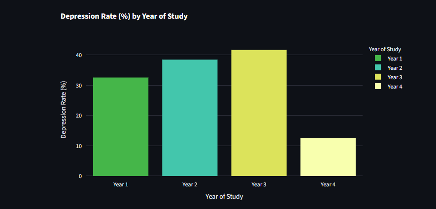
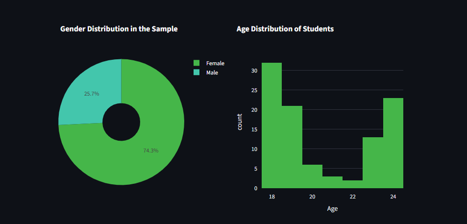

# Student Mental Health Analysis


## 1. Introduction & Project Relevance

Student mental health is a critical component of academic success and overall well-being. With increasing academic and social pressures, understanding the factors that influence the mental state of students is more important than ever.

This project aims to leverage data analysis to explore and identify patterns related to mental health issues among university students. By transforming raw data into clear and interactive visualizations, the goal is to provide insights that could inform better support strategies and resources within educational institutions.

## 2. Project Objective

The primary objective of this project was to build a full data pipeline, from data ingestion and cleaning to analysis and interactive visualization. The key tasks were:

-   To process and clean a raw CSV dataset using **Pandas**.
-   To load the structured data into a **PostgreSQL** relational database.
-   To perform data aggregation and analysis using **SQL** queries executed via Python.
-   To build an interactive dashboard with **Streamlit** and **Plotly** to present the findings visually.

## 3. Tech Stack

-   **Language:** Python 3.13.6
-   **Database:** PostgreSQL
-   **Core Libraries:**
    -   **Pandas:** For data loading, cleaning, and transformation.
    -   **SQLAlchemy:** For connecting and interacting with the PostgreSQL database.
    -   **psycopg2-binary:** The PostgreSQL driver for Python.
    -   **Streamlit:** For building and serving the interactive web dashboard.
    -   **Plotly Express:** For creating interactive visualizations.

## 4. The Data Pipeline

The project follows a modular, script-based data pipeline:

1.  **Data Exploration & Cleaning (`explore_data.py`):** The raw CSV data is loaded into a Pandas DataFrame. Column names are standardized, categorical data is encoded (e.g., "Yes"/"No" to 1/0), and data inconsistencies (e.g., capitalization) are resolved.
2.  **Database Loading (`load_data.py`):** The cleaned DataFrame is loaded into a `students` table in the PostgreSQL database. This script imports the cleaning logic, ensuring that only clean data is persisted.
3.  **Analysis & Visualization (`dashboard.py`):** An interactive dashboard connects to the database, runs an aggregation query to calculate key metrics, and visualizes both the aggregated and raw data using interactive charts.

## 5. Interactive Dashboard & Findings

The interactive dashboard serves as the final product of this analysis, presenting the key insights in an accessible format. It includes visualizations for the aggregated analysis and the raw data distributions.

#### **Analysis by Year of Study**


#### **Demographic Distributions**


## 6. How to Run the Project

To run this project locally, follow these steps:

1.  **Clone the Repository:**
    ```bash
    git clone <your-repository-url>
    cd <repository-folder-name>
    ```

2.  **Create and Activate a Virtual Environment:**
    ```bash
    # For Windows
    python -m venv .venv
    .\.venv\Scripts\activate
    ```

3.  **Install Dependencies:**
    ```bash
    pip install -r requirements.txt
    ```

4.  **Set Up PostgreSQL Database:**
    -   Ensure you have a running PostgreSQL server.
    -   Create a database for the project (e.g., `CREATE DATABASE students_mental_health;`).
    -   Update the database credentials (`DB_USER`, `DB_PASSWORD`, `DB_NAME`, etc.) at the top of the `load_data.py` and `dashboard.py` files.

5.  **Run the Data Pipeline and Dashboard:**
    -   First, load the data from the CSV into the database:
        ```bash
        python load_data.py
        ```
    -   Then, run the interactive dashboard:
        ```bash
        streamlit run dashboard.py
        ```